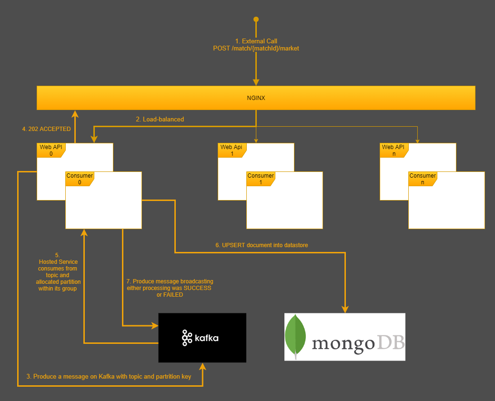
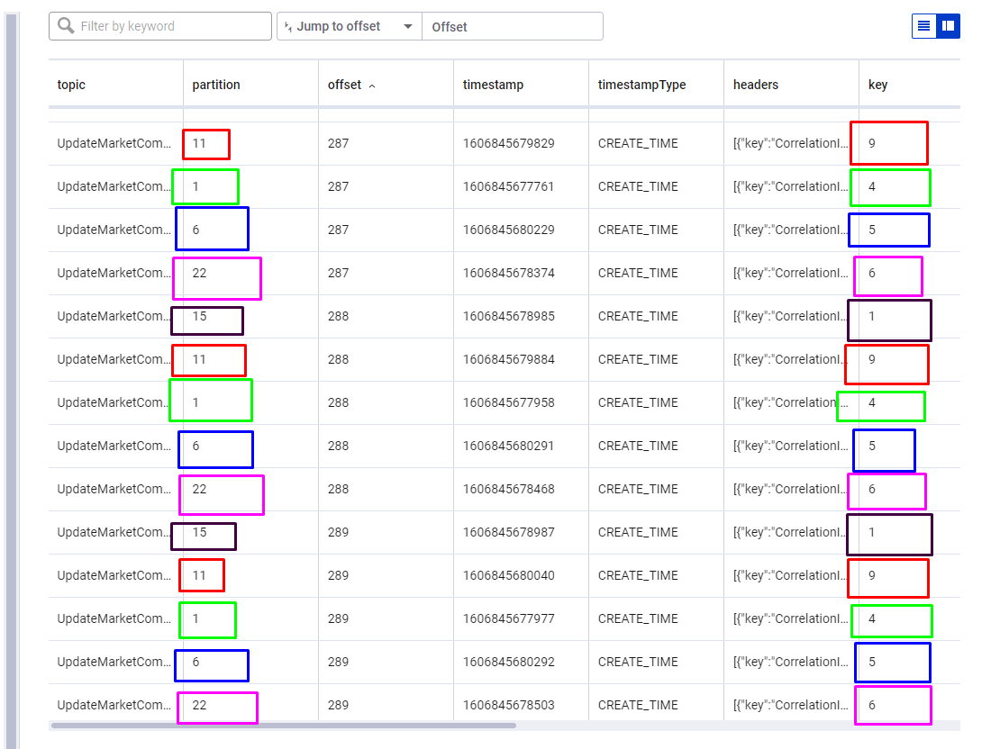
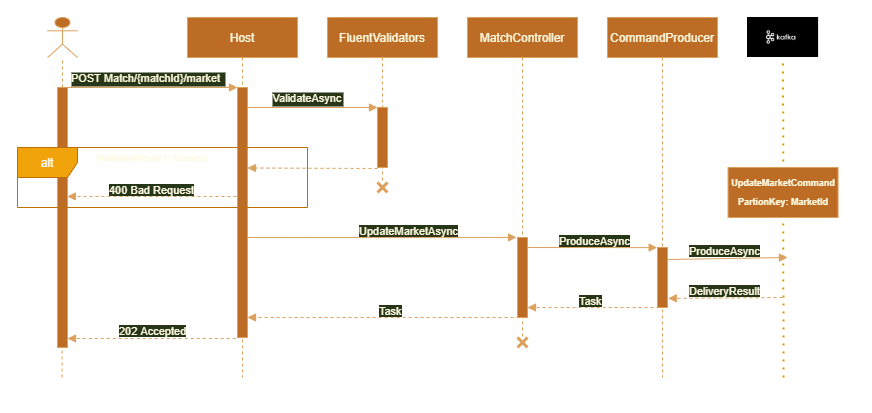
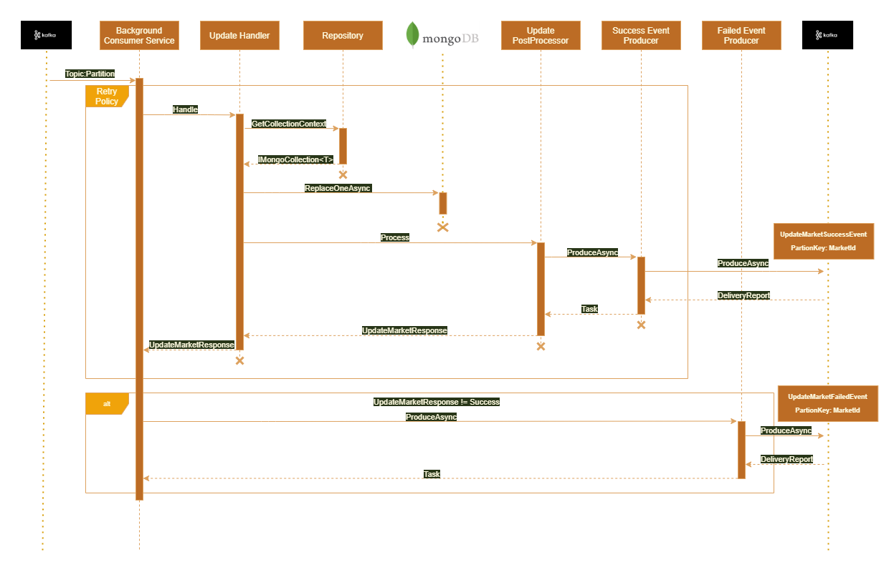
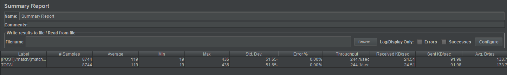

# External Test

1. [ Problem Definition ](#probdef)
2. [ Instructions ](#instructions)
3. [ Requirements ](#requirements)
4. [ Tech Stack ](#tech-stack)
5. [ High Level Architecture Design ](#high-level-arch)
6. [ Achieving Requirements ](#achieve-req)
    - [ Able to process the updates received as fast as possible; to not pileup ](#first-req)
    - [ Processing updates for the same entity identifier in order ](#second-req)
    - [ Minimizing the chance of losing an update and not processing it ](#third-req)
    - [ System is to be highly available, ideally having no Single-Point-Of-Failure and able to recover fromfaults should one specific service instance crash ](#fourth-req)
    - [ Scaling (vertically/horizontally) with minimal effort (ideally no code changes) ](#fifth-req)
7. [ Application Startup & Configurations  ](#app-startup)   
8. [ Web REST API Sequence  ](#web-api)
9. [ Hosted Service Consumer Sequence  ](#hosted-service)
10. [ Datastore Document Entity Structure  ](#datastore)
11. [ Containerization and running the app  ](#container)
12. [ Load Tests  ](#load)
13. [ 3rd Party Library Dependencies  ](#libs)
14. [ Assumptions  ](#assumptions)
15. [ Future Improvements  ](#future)
16. [ Further Reading & References ](#refs)

<a name="desc"></a>
## 1. Description

<a name="probdef"></a>
## Problem Definition

Design a system which is able to receive market updates (structure shown below) and process them as fast as possible. 
The updates will be received on a REST API you control, the API should offload the market update to other services for processing otherwise it will not keep up. 
The processing per update involves deserialization, saving data to a data store of your choice, and once saved publish a message indicating that it was done. 
The API will be receiving multiple updates for the same entity identifiers thus it is important that updates for the same entity identifier are processed in order, failure to do so will result on the wrong odds showing on the site.

Example Market Update Structure:
- Market ID (**Entity Identifier**) – 123
- Market Type – “Match Result”
- Market State - Open
- Market Selections:
    - Selection
        - Selection Name – “Home”
        - Selection Price – 1.6

<a name="instructions"></a>
## Instructions

Design the rest of the system to accomplish the requirement; you may use any technology/systems you are familiar with to create the best solution. Use any means familiar to you to convey the system design in a clear way, you will be presenting the design and providing reasoning/assumptions for the choices made and expected to defend them.

<a name="requirements"></a>
## Requirements

- Able to process the updates received as fast as possible; to not pileup
- Processing updates for the same entity identifier in order
- Minimizing the chance of losing an update and not processing it
- System is to be highly available, ideally having no Single-Point-Of-Failure and able to recover fromfaults should one specific service instance crash
- Scaling (vertically/horizontally) with minimal effort (ideally no code changes)

<a name="tech-stack"></a>
## Tech Stack

### Apache Kafka
Kafka has been chosen as the primary message broker notably for three reasons:
1. With the default scheme; any consumers within a consumer group will each be assigned a partition per topic. Thus, no competing consumers for a given partition. This essentially result in inherent message ordering. In the implementation, the partition key used is the MarketId
2. Kafka with replication and message persistence can offer out-of-the-box HA (high availability) and also the ability to persist and replay messages at a later stage 
3. Kafka consumers are stateless. Offsets are kept on the broker, therefore in case of crashes, elected consumers for the partition can pick up from the last offset that has been committed

### MongoDB
The reasons for selecting MongoDB as the main datastore are twofold: 
1. Better performance when compared to a traditional RDBMS when performing inserts since no relational constraints checks overheads. Given that our system is more insert heavy (this is an assumption I am doing)
2. The ability of not having a rigid schema. Some markets have different selections, thus I believe that a schema-less document database is more adequate for the task at hand

<a name="high-level-arch"></a>
## High Level Architecture Design


<a name="achieve-req"></a>
## Achieving Requirements

<a name="first-req"></a>
### Able to process the updates received as fast as possible; to not pileup
The Web REST API is designed to be a thin 'layer' which will attempt to produce the messages immediately and return 202 Accepted to the caller in order to offload processing responsibility to the background consuming services. Thus, response times are kept to the minimum in order not to block any upstream calling services/processes. 

<a name="second-req"></a>
### Processing updates for the same entity identifier in order
As explained in the motivation for choosing Kafka as the message broker; Order is guaranteed by: 
- Producing messages to a topic, using Market Identifier as the partitioning key
- No retry policies on the producing part (the web api) in order to avoid any race-conditions
- All consumers form part of the same consumer group. Therefore no competing consumers per group, and thus each consumer will consume messages in-order from the respective partition
- Idempotency. From both kafka and mongo/datastore perspective

The image below is a screenshot from the Control Centre which shows that a **key** (the partition key which under the hood we specify it to be the MarketId), is always mapped to the same partition. Therefore, since each partition will be consumed **solely** by a single consumer in a consuming group, order is guaranteed.


<a name="third-req"></a>
### Minimizing the chance of losing an update and not processing it
- Producer will wait for ACK.ALL, meaning that if a delivery report returns without error, the message has been replicated to all replicas in the in-sync replica set
- Retry policy with jittered exponential back-off on the consumer part to mitigate transient faults 

<a name="fourth-req"></a>
### System is to be highly available, ideally having no Single-Point-Of-Failure and able to recover from faults should one specific service instance crash
- Health checks for external system dependencies
- Given a consumer group leader within a consuming group, a rebalance will happen under the hood (done inherently by kafka) whenever one consumer crashes or leaves the group 
- If for any reason the database instance is down or un-reachable, kafka out-of-the-box persists messages for a duration of time (configurable). This enables business to replay events

<a name="fifth-req"></a>
### Scaling (vertically/horizontally) with minimal effort (ideally no code changes)
- Containerization. As shown in the “**Load Tests**” sections below, I was able to scale my application by having a LB in front as an ingress (I chose NGINX for simplicity, could be anything) running the following command on docker-compose: 

```bash
    docker-compose up -d --scale externalhost=5
```

<a name="app-startup"></a>
## Application Startup & Configurations
On startup the following registrations and/or setting configurations are applied:
- Any fluent validations are registered using an assembly marker (in this case, Startup.cs assembly)
- Kafka producer registrations (both IKafka implementations, but also our own IProducerService that wrap the Kafka dependencies)
- Kafka consumers (`IConsumer`)
- Hosted services (`BackgroundService` which is essentially where the consumer will be running)
- RegisteringMediatr pipeline (Handlers, Post-Processors, etc…)
- AutoMapper registration, using an assembly marker for the profiles 
- Registration of the MongoDB client, and of the data repositories (`IMongoClient` and `IRepository<MarketUpdateEntity>`
- Adding/Registration of health checks (Exposed health checks for both Kafka and MongoDB). Health checks are exposed on /health
- Registration of RetryPolicy configurations

### Database Configuration via appsettings.json
```javascript
  "Database": {
    "ConnectionString": "mongodb://localhost:27017",
    "Repositories": [
      {
        "Name": "MarketUpdateRepository",
        "Database": "Markets",
        "Collection": "Updates"
      }
    ]
  }
```

Important to note that for the `IRepository<MarketUpdateEntity>` implementation, an `IOptionsMonitor<List<RepositoryOptions>>`  is injected. The reason for this design choice is as follows:
- The implementation can be extended to have multiple repositories (for example repo/collection combination for Update, and another for Insert)
- Repository details (collection and database name) can be changed (via the config) on the fly leveraging the options monitor `OnChange` delegate

### Kafka Configuration via appsettings.json
```javascript
  "Kafka": {
    "ConnectionString": "localhost:9092",
    "Producers": [
      {
        "MessageType": "UpdateMarketCommand",
        "EnableTopicCreation": true,
        "NumPartitions": 24,
        "Configurations": {
          "partitioner": "murmur2",
          "acks": "all",
          "enable.idempotence": "true"
        }
      }
    ],
    "Consumers": [
      {
        "MessageType": "UpdateMarketCommand",
        "Configurations": {
          "group.id": "market-update-group",
          "auto.offset.reset": "earliest"
        }
      }
    ]
  }
```
Same as for the database, multiple consumers and producers can be configured with each having their own set of settings. An important property to note is the EnableTopicCreation. On application startup, the implementation has bee executed in a way that if this setting is set to true, the application will under the hood attempt to create the topic, with the given settings for you. Thus this means that devops intervention is kept to the minimum.
In the Configurations sections (both Consumers and/or Producers) the following settings can be applied:
[Kafka Configurations](https://kafka.apache.org/documentation/#configuration)

### Retry Policy Configuration via appsettings.json
```javascript
  "RetryPolicy": {
    "MedianFirstRetryDelayInSeconds": 3,
    "RetryCount": 3
  }
```

The above section is optional, and if nothing is explicitly provided, the default values will be applied, i.e.
- `MedianFirstRetryDelayInSeconds` = 5
- `RetryCount` = 5

For more information on the retry policy of choice, check out the official documentation over here; 
[Polly Contrib](https://github.com/Polly-Contrib/Polly.Contrib.WaitAndRetry#new-jitter-recommendation)

<a name="web-api"></a>
## Web REST API Sequence
- A request with a POST verb is issued from external sources
- MatchId (int) from route. Payload body example as follows:

```javascript
{
    "marketId": 12,
    "marketType": "Over & Under",
    "marketState": "Closed",
    "selections": [
        {
            "name": "Over",
            "price": 12.89
        },
        {
            "name": "Under",
            "price": 1.12
        }
    ]
}
```

- Validation middleware (_FluentValidation_) executes and validates the payload request DTO
    - _400 Bad Request_ HTTP response is returned if validation is not successful 
- `UpdateMarketAsync` within the `MatchController` maps the request DTO (_AutoMapper_), and issues a call to `MarketUpdateCommandProducer : IProducerService<int, UpdateMarketCommand>` (Core layer)
- The producer service is essentially a wrap for the _Kafka_ `IProducer<TKey, TMessage>` implementation which will call `ProduceAsync` and await for a delivery report. Before the ProduceAsync call is issued, the message command is decorated with a “CorrelationId”, to be used to correlate messages in the db and subsequent events 
- Messages are published to **UpdateMarketCommand** topic using **MarketId** as the partition key for ordering purposes 
- _202 Accepted_ HTTP response is returned which is the suggested response in eventual consistent paradigms

### Miscellaneous
No resilience is implemented at a producer level, such as retry policies etc… This is done by design. The reason being is that whilst a retry policy is being executed (imagine a transient network fault), the next message in the sequence for that MatchId:MarketId combination might have been received by the system and produced successfully, resulting in out of order sequences. Essentially omitted to mitigate possible race-conditions while executing any resilience policies. 


<a name="hosted-service"></a>
## Hosted Service Consumer Sequence
- The consumer is essentially a `BackgroundService:IHostedService`. On start-up it subscribes to a Kafka topic with the name of `UpdateMarketCommand`
- Important to note that since the consumer/s are part of a “_Consumer Group_” (**market-update-group** by default config), it is guaranteed that no two consumers will be consuming from the same partition (no competing consumers), thus guaranteeing order per _MarketId_
- A _Wait-and-Retry_ policy with jittered back-off wraps the whole flow up until a success event is produced, or till all the retries (5 by default) have been exhausted
    - In case of retry exhaustion, a failed event message, of type _UpdateMarketFailedEvent_ will be produced to a topic of the same name as the event
- A mediator pattern (using 3rd party library _MediatR_) is used to abstract implementation details from the consumer. The consumer will only have to invoke `await _mediator.Send(message.Message.Value, token)`
- An update handler (`MarketUpdateHandler:IRequestHandler<UpdateMarketCommand, UpdateMarketResponse>`) processes the request by:
    - Mapping the request command to the database entity _MarketUpdateEntity_
    - Getting the database collection context for the entity type
    - Calling _ReplaceOneAsync_ on the _IMongoCollection<MarketUpdateEntity>_ 
    - Instantiating an _UpdateMarketResponse_ and setting the Success flag to true
- **In The above step it is important to note that:**
    - Any exceptions will be thrown to the caller, and hence handled by the policy wrap
    - `ReplaceOneAsync` is idempotent and it is implemented in a way to perform **UPSERT**. This is done in order to remove any possibility of deduplication 
    - The “CorrelationId” is used as the database collection Id column
- Within the mediator pipeline, a “_PostProcessor_“ (`MarketUpdatePostProcessor`) will handle any `UpdateMarketResponse` which have the Success flag set to true. As per requirements, the post-processor is responsible for calling the `MarketUpdateSuccessEventProducer` ProduceAsync method to produce messages of type `UpdateMarketSuccessEvent` to a partition on Kafka of the same name(using MarketId as partition key) 
- Process is repeated for the same MarketId key within the partition (to be precise a consumer might read from other partitions as well, however a partition will never be shared with any other consumer/s)


<a name="datastore"></a>
## Datastore Document Entity Structure
- Default database name: Markets
- Default collection name:: Updates

The following is an example of structure of the document entity that is persisted in the DB. 
```javascript
{
    _id: '7dc4e6b8-aff6-4551-8d0a-5fbf033f2795', --Stringified CorrelationId
    CreatedAt: ISODate('2020-12-02T15:04:23.958Z'),
    MatchId: 5655,
    MarketId: 10,
    MarketType: 'Goal No Goal',
    MarketState: 0,
    Selections: [
        {
            Name: 'Over',
            Price: 12.3
        },
        {
            Name: ' 1',
            Price: 7.74
        }
    ]
}
```

Below are some examples queries to be used to search/filter and project the data:
- `{ "MarketType": "Over & Under" }` Returns all documents matching the condition
- `{ "Selections.Name": "Over" }` Returns all documents where the array of ‘Selections’ contains at least one entry matching the condition, irrespective of the index position
- `{ "Selections.0.Name": "Over" }` Returns all documents where **only** the first item in the array of ‘Selections’ contains the matching the condition 
- `{ $and: [ { "Selections.0.Name": "Over" }, { "Selections.Price": 12.3 } ] }` Returns all documents where **only** the first item in the array of ‘Selections’ contains the matching **AND** the condition 

For more query examples, please refer to [MongoDB reference](https://docs.mongodb.com/manual/reference/operator/)

<a name="container"></a>
## Containerization and running the app

The full implementation is container ready. In order to run the application, navigate to the docker folder and execute the following:

```bash
    docker-compose up -d 
```

The following command will pull/build/run the following containers:
- **Confluent Control Center**. Essentially a control center (admin) for Kafka (think RabbitMq Admin) 
- **Confluent Zookeeper**. Manages essential kafka cluster metadata
- **Kafka**. Apache Kafka is an open-source stream-processing software platform developed by the Apache Software Foundation
- **MongoDB**. MongoDB document databases provide high availability and easy scalability
- **Mongo Express**. Web-based MongoDB admin interface, written with Node.js and express
- **ExternalHost**. Our application service
- **Nginx**. Nginx (pronounced "engine-x") is an open source reverse proxy server for HTTP, HTTPS, SMTP, POP3, and IMAP protocols, as well as a load balancer, HTTP cache, and a web server (origin server). nginx.conf is used to proxy

### Relevant Exposed Endpoints
- [ExternalHost via NGINX](http://localhost:4000/swagger/index.html) 
- [Kafka Control Centre](http://localhost:9021/clusters)
- [MongoDB Express](http://localhost:8081/)

<a name="load"></a>
## Load Tests
Load  testing was performed using the [**Apache JMeter**](https://jmeter.apache.org/). The set-up for the load tests was as follows: 
- The whole stack was running on my machine’s docker server instance:
    - Kernel Version: 4.19.104-microsoft-standard
    - Operating System: Docker Desktop
    - OSType: linux
    -Architecture: x86_64
    - CPUs: 8
    - Total Memory: 12.37GiB
- My machine’s specs:
    - Processor: Intel(R) Core(TM) i7-8550U CPU @ 1.80GHz 2.00GHz
    - RAM: 16 GB
    - OS: Windows 10
    - Architecture: 64-bit OS, x64 based processor
- ExternalHost, which is our application that we want to load, was scaled to 5 instances with NGINX acting as a load balancer proxying requests (LB and proxying defined in nginx.conf)
- Number of threads was saturated at 75. Meaning 75 concurrent users calling the web API endpoint. Increasing the value would result in degradation 
- Each user will call the endpoint for 100 times. therefore 7.5K calls in total per test run

In order to set up our environment, the following command was issued, in order to scale the application to 5 instances:
```bash
    docker-compose up -d --scale externalhost=5
```

The following results were achieved. It is important to note that whilst running the tests, my machine was strained to the limit, with CPU and MEM consumption 100%. This means that if the tests would have been replayed on a better stacked machine, the results would be considerably better. 


**Label**  | **Value**
------------- | -------------
Minimum  | 19ms
Std. Deviation  | 51.65
Average  | 119ms
Throughput  | 244requests/sec
Maximum  | 436ms

The full load test profile can be found here /tests/load/external.test.jmx

<a name="libs"></a>
## 3rd Party Library Dependencies
- [AutoMapper](https://github.com/AutoMapper/AutoMapper)
- [MediatR](https://github.com/jbogard/MediatR)
- [FluentValidation](https://github.com/FluentValidation/FluentValidation)
- [confluent-kafka-dotnet](https://github.com/confluentinc/confluent-kafka-dotnet)
- [mongo-csharp-driver](https://github.com/mongodb/mongo-csharp-driver)
- [Polly](https://github.com/mongodb/mongo-csharp-driver)
- [Polly.Contrib.WaitAndRetry](https://github.com/Polly-Contrib/Polly.Contrib.WaitAndRetry)
- [Bogus](https://github.com/bchavez/Bogus)
- [xunit](https://github.com/xunit/xunit)
- [moq](https://github.com/moq/moq)

<a name="assumptions"></a>
## Assumptions
The biggest assumption in the undertaking of this project is that the persisting of the events in the datastore are for auditing/debugging/historical purposes and not for real-time processing and/or querying. 

If that had been the case, more effort would have been invested in that aspect, such as datastore optimizations, etc… 

Another assumption that I’ve taken was that the “Market ID” property is a unique identifier for the “Market Type”. In relational terms, my assumption was that the MarketId is essentially the primary key for a hypothetical Markets table, therefore a table can be normalized using it as a key. 

<a name="future"></a>
## Future Improvements
- Distributed Tracing
- Integration Testing
- Increased code coverage from tests 
- Implement Circuit Breaker policy on the producer side (REST API), so as to trip the circuit for some predefined time if the broker is down
- Fine tuning of database settings (indexes, shards, replicas. etc…)
- Fine tuning of Kafka producer and/or consumer settings such as partitioning etc…
- API Authentication 
- Overall security (Kafka, MongoDB, etc…)
- Benchmarking
- Overall refactoring to abstract common code in core libraries etc… 

<a name="refs"></a>
## Further Reading & References
- [Kafka](https://kafka.apache.org/documentation/)
- [Kafka dotnet](https://github.com/confluentinc/confluent-kafka-dotnet/wiki)
- [Docker](https://docs.docker.com/reference/)
- [MongoDB](https://docs.mongodb.com/manual/reference/operator/)
- [MongoDB csharp](https://docs.mongodb.com/drivers/csharp)